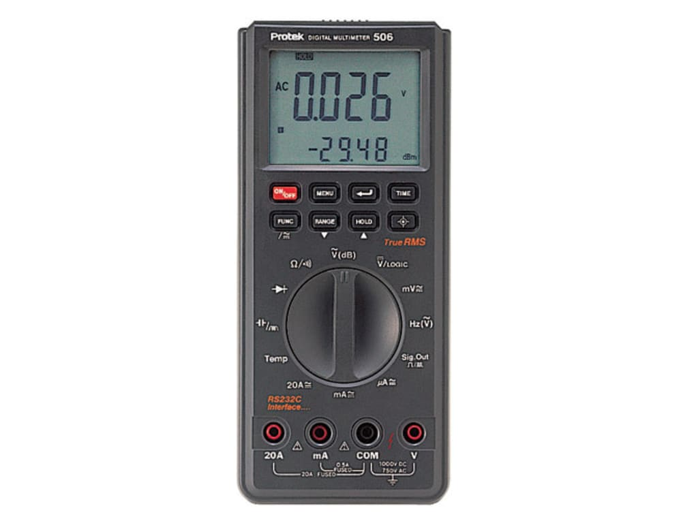
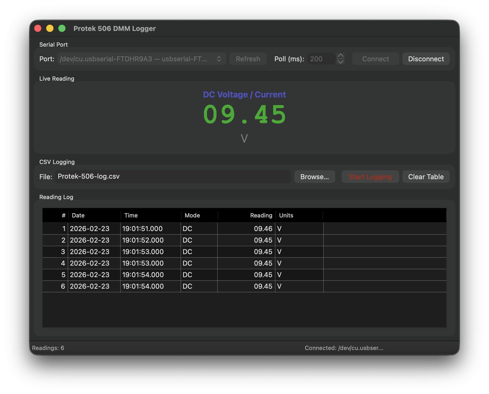

# Protek 506 DMM Logger — wxWidgets C++ GUI

A cross-platform desktop application to read, display, and log data
from the **Protek 506 Digital Multimeter** via its RS-232C serial interface.



Built with **C++ 17** and **wxWidgets 3.2+**.

---

## Features

- Auto-detects USB-to-serial adapters (FTDI, CH340, PL2303, etc.)
- Large live reading display with colour-coded values
- Configurable polling interval (50–5000 ms)
- CSV logging with automatic header; appends to existing files
- Scrollable reading log table (last 5,000 rows kept in memory)
- Cross-platform: **macOS**, **Windows 11**, **Linux**



---

## Current Release

*  Version 1.3.0
---

## Meter Setup

Before connecting:

1. Power on the Protek 506.
2. Press **MENU** until the **RS232** annunciator blinks.
3. Press **Enter** (↵) to activate RS232 mode.  
   The **RS232**, **RX**, and **TX** annunciators will appear.
4. Connect the DB-9 RS-232 cable (or USB-serial adapter).

Serial parameters (fixed, matches meter firmware):  
`1200 baud · 7 data bits · 2 stop bits · No parity`

> **Windows physical RS-232:** You may need a **null-modem** (crossover)
> cable if using the PC's native COM port directly.

---

## Dependencies

| Dependency | Version | Notes |
|------------|---------|-------|
| CMake      | ≥ 3.16  | Build system |
| wxWidgets  | ≥ 3.2   | GUI framework |
| C++ compiler | C++17 | GCC 9+, Clang 10+, MSVC 2019+ |

No external serial library is required — the app uses native OS APIs
(Win32 on Windows, POSIX termios on macOS/Linux).

---

## Building

### macOS

```bash
# Install dependencies (Homebrew)
brew install cmake wxwidgets

# Clone / download the source, then:
mkdir build && cd build
cmake .. -DCMAKE_BUILD_TYPE=Release
make -j$(sysctl -n hw.logicalcpu)

# Run
open Protek506Logger.app
# or
./Protek506Logger
```

> If Xcode command-line tools are installed but you prefer a Makefile build,
> add `-G "Unix Makefiles"` to the cmake invocation.

#### macOS Xcode project

```bash
mkdir build-xcode && cd build-xcode
cmake .. -G Xcode
open Protek506Logger.xcodeproj
```

---

### Linux (Debian / Ubuntu)

```bash
# Install dependencies
sudo apt-get update
sudo apt-get install -y cmake build-essential \
    libwxgtk3.2-dev        # or libwxgtk3.0-gtk3-dev on older distros

mkdir build && cd build
cmake .. -DCMAKE_BUILD_TYPE=Release
make -j$(nproc)
./Protek506Logger
```

#### Fedora / RHEL / Rocky

```bash
sudo dnf install cmake gcc-c++ wxGTK-devel
mkdir build && cd build
cmake .. -DCMAKE_BUILD_TYPE=Release
make -j$(nproc)
./Protek506Logger
```

#### Serial port permissions (Linux)

On most Linux distributions, the user must be in the `dialout` group
to access serial devices:

```bash
sudo usermod -aG dialout $USER
# Log out and back in for the change to take effect
```

---

### Microsoft Windows 11

#### Prerequisites

- **Visual Studio 2022** (Community or better) with the
  *Desktop development with C++* workload, **or** MinGW-w64 + MSYS2.
- **CMake** ≥ 3.16 (included in Visual Studio, or install from cmake.org).
- **wxWidgets** ≥ 3.2 — see below.

#### Building wxWidgets (if not using a binary release)

```cmd
# In the wxWidgets source directory:
mkdir build-wx && cd build-wx
cmake .. -G "Visual Studio 17 2022" -A x64 ^
      -DwxBUILD_SHARED=OFF
cmake --build . --config Release
cmake --install . --prefix C:\wx32
```

Then set the environment variable:

```cmd
set wxWidgets_ROOT_DIR=C:\wx32
```

#### Building Protek506Logger

```cmd
mkdir build && cd build
cmake .. -G "Visual Studio 17 2022" -A x64
cmake --build . --config Release
Release\Protek506Logger.exe
```

Or with MSYS2 / MinGW:

```bash
pacman -S mingw-w64-x86_64-cmake mingw-w64-x86_64-wxwidgets3.2-msw
mkdir build && cd build
cmake .. -G "MSYS Makefiles" -DCMAKE_BUILD_TYPE=Release
make -j$(nproc)
./Protek506Logger.exe
```

---

## Project Structure

```
protek506wx/
├── ChangeLog               # Version history
├── CMakeLists.txt          # Top-level build script
├── LICENSE                 # Software license description
├── README.md               # This file
├── References/
│   ├── Protek_506_Manual.pdf   # Manual for Protek 506 DMM
│   ├── protek_506.jpg          # Picture of a Protek 506
│   └── Protek506Logger.png     # Screenshot of the application
├── resources/
│   ├── win32.rc            # Windows resource file
│   └── protek506.ico       # Application icon
└── src/
    ├── App.h / App.cpp         # wxApp entry point
    ├── MainFrame.h / .cpp      # Main application window
    ├── ReaderThread.h / .cpp   # Background serial-polling thread
    ├── DmmParser.h / .cpp      # Parses Protek 506 ASCII data format
    ├── CsvLogger.h / .cpp      # CSV file writer
    ├── Events.h.               # Events header
    └── SerialPort.h / .cpp     # Cross-platform RS-232 wrapper
```

---

## CSV Log Format

```
date,time,mode,reading,units
2025-07-01,14:32:01.345,DC,12.34,V
2025-07-01,14:32:01.547,DC,12.35,V
```

The log file is opened in **append** mode; the header row is written
only when the file is new or empty.

---

## Troubleshooting

| Symptom | Likely cause |
|---------|-------------|
| No ports listed | Driver not installed; try re-plugging adapter |
| "Cannot open port" | Wrong port selected; port in use by another app |
| "----" displayed, no data | RS232 mode not enabled on meter |
| Garbled readings | Confirm 1200 baud, 7N2 in OS settings |
| Linux: permission denied | User not in `dialout` group |
| Windows: null-modem needed | Using PC's native COM port with straight cable |

---

## License

Released under the MIT License. See LICENSE file for details.
